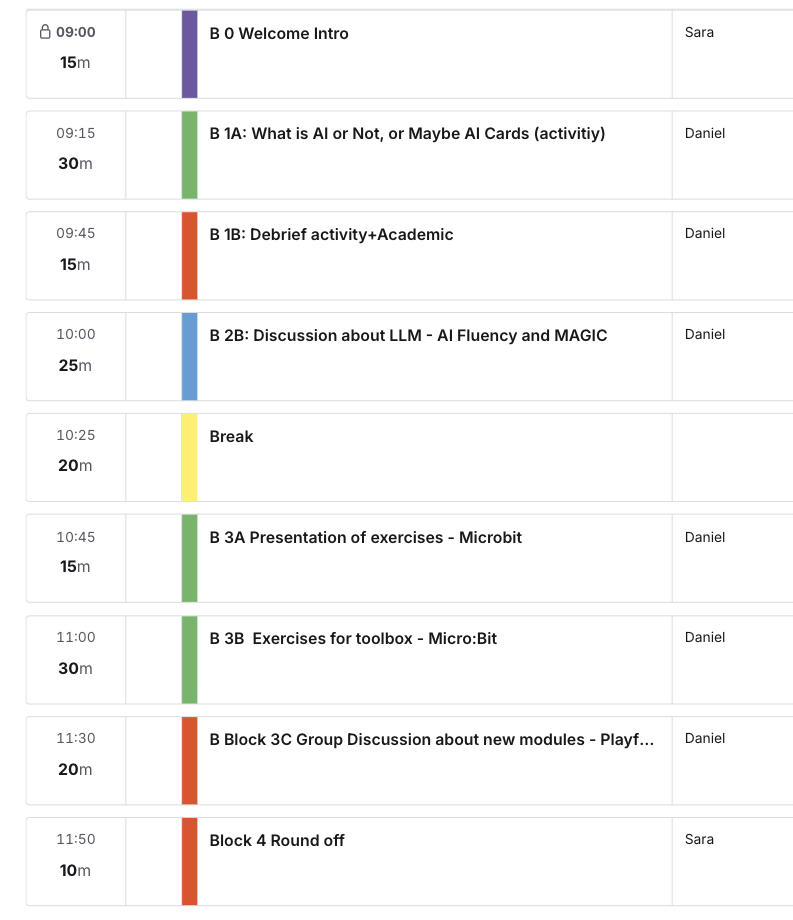
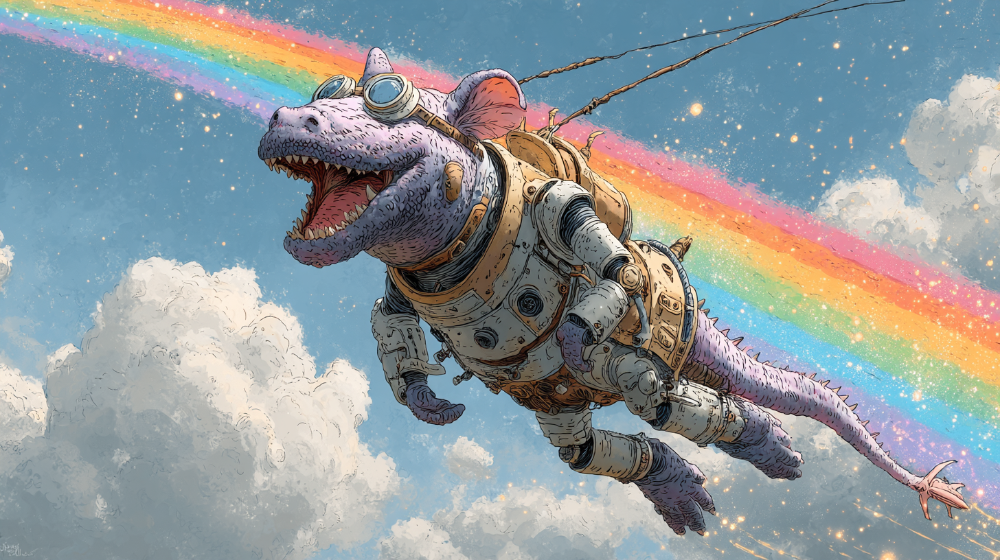

<!-- _class: lead -->

# Didactic Transposition and AI Literacy

### Why Playful AI with IoT and Generative AI?

Daniel Spikol
DIKU and Center for Digital Education
21 Sept 2026

---
## Today's Agenda
1. Introduction
2. Activitiy – Is it AI?
3. Mini Seminar - Didactic Transposition and AI Literacy
4. Microbit &rarr; Teacable Machine and Claude
5. AI Fluency
6. Wrap it

---

## The Visual Plan

---
## Introductions

### 2 Sentences:
1. Who you are?
2. What do want from this morning

---
## Why Playful?
1. Playful Learning
2. Curiosity
3. Tinkering, Hacking, & Creativity