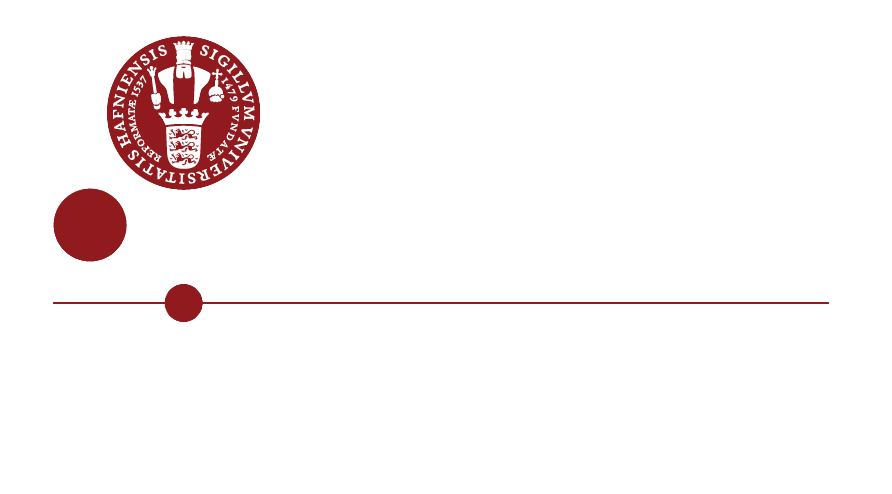

<!-- _class: lead -->

# Didactic Transposition and AI Literacy

### Seminar 1 · Playful AI with IoT and Generative AI

---

## This morning you already did the theory

You sorted cards and argued about thermostats.

**The activitiy was a transpositions**: research-level ideas, rebuilt into something you could argue about before coffee.

---

<!-- _class: lead -->

# Knowledge does not travel unchanged

---

## The core claim (Chevallard, 1985)

Knowledge is transformed every time it moves:

**Scholarly knowledge**
*what researchers produce*
↓
**Knowledge to be taught**
*curricula, textbooks, exam requirements*
↓
**Taught knowledge**
*what happens in your classroom*
↓
**Learned knowledge**
*what students actually take away*

Each arrow is a transformation, not a transfer.

---

## Every arrow changes the knowledge

At each step, something is:

- **Selected** — most of the field is left out
- **Simplified** — continuous things become discrete, messy things become clean
- **Recontextualised** — removed from research problems, attached to school problems
- **Time-structured** — split into lessons, sequenced, made examinable

None of this is corruption. **It is the condition for teachability.**

The question is never *whether* to transform, but whether the transformation is honest.

---

## Why AI makes this urgent

The AI transposition chain is unusually broken:

- Scholarly knowledge moves **fast** — the textbook step cannot keep up
- The public chain runs through **media and marketing**, not curricula
- The dominant metaphors — *thinking*, *knowing*, *hallucinating* — are borrowed from minds, and they mislead
- Your students arrive **already taught**, by TikTok, by product launches, by each other

You are not writing on a blank slate. You are correcting a transposition already done badly.

---

<!-- _class: lead -->

# Watch the transposition in this morning's activities

---

## "Is this AI?" — transposing a definition problem

**Scholarly version:** decades of unresolved debate about intelligence, agency, and learning in the research literature.

**This morning's version:** 36 cards and an argument.

What survived: the genuine instability of the concept.
What was cut: the entire technical apparatus.

**The honest move:** the activity never pretends the question has an answer. The disagreement *is* the content.

---

## The dishonest transposition, for contrast

Familiar from textbooks and news media:

- "The AI **understands** your question"
- "The model **knows** billions of facts"
- A brain image with glowing circuits
- The robot hand touching the human hand

Each one transposes AI into folk psychology.

Fluent, memorable (click bait) &rarr; and it points peoples' intuitions in exactly the wrong direction.

---

<!-- _class: lead -->

# A working tool, not just a theory

---

## The transposition check

Three questions to ask of any AI activity — yours or anyone's:

1. **What was simplified?**
   Name the cuts explicitly. There are always cuts.

2. **Is the simplification honest?**
   Does it point intuition in roughly the right direction, or does it plant a misconception that must later be unlearned?

3. **What could a student wrongly conclude?**
   The best activities know their own failure modes.

---

## AI literacy, restated

On this view, AI literacy is **not**:

- a list of facts about neural networks
- tool training for the current interface
- pure critique from a safe distance

It **is** the capacity to ask, of any AI claim or system:
*what is actually going on here, what has been simplified for me, and by whom?*

That capacity is built through honest transpositions — which is what this workshop is for.

---

## Where this goes next

- We work with the Micro:Bit and AI
- The same lens on generative AI — where the transposition problem gets harder.
- Playfull approach

---

<!-- _class: lead -->

## Reading, if you want it

Achiam, didactic transposition as a research programme
*(link in the programme document)*

The wall definitions from this morning stay up all five days.
**Revise them as you go.**

