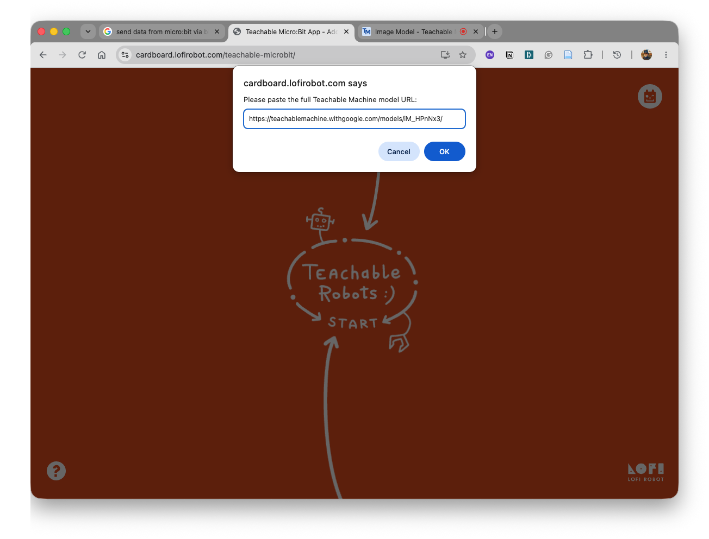
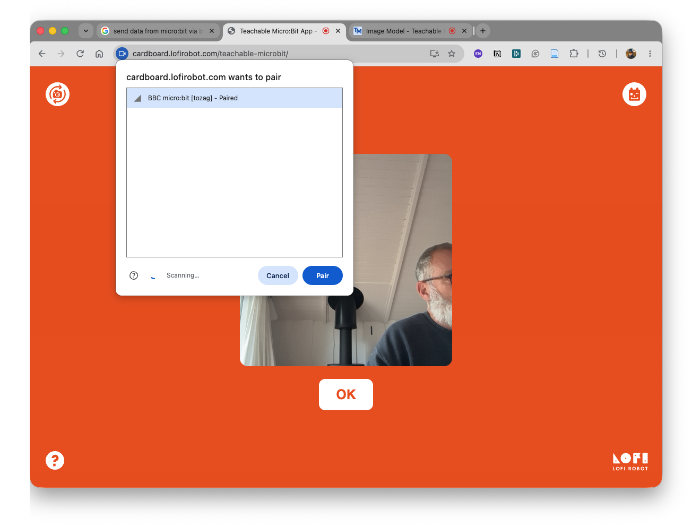
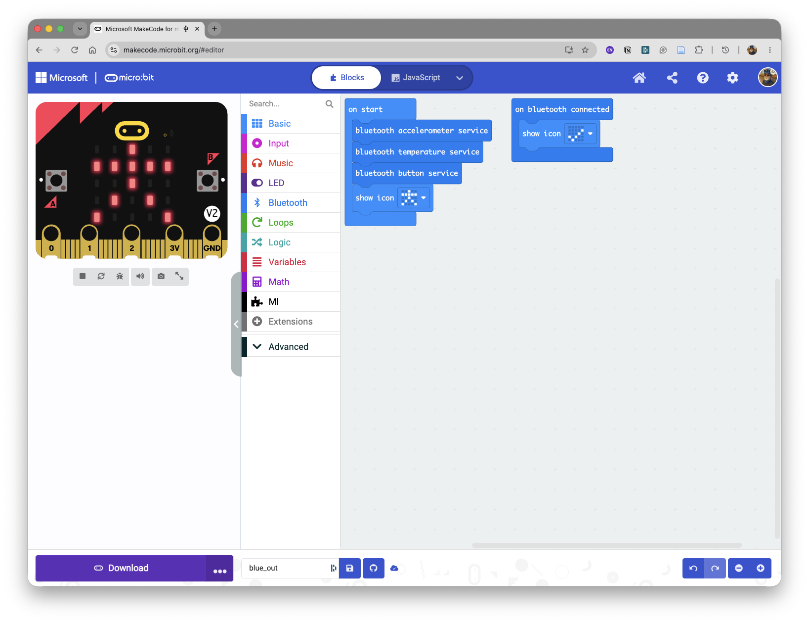
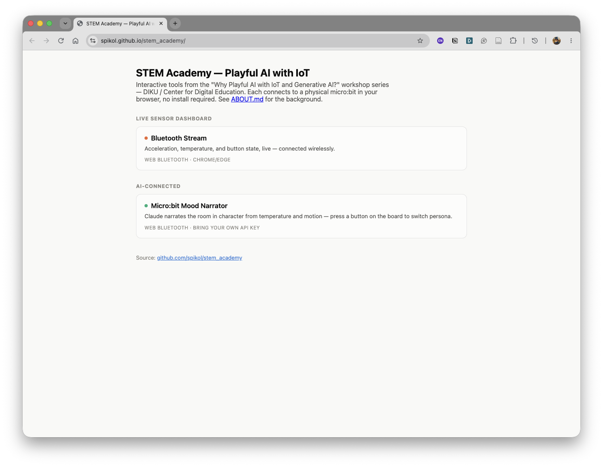
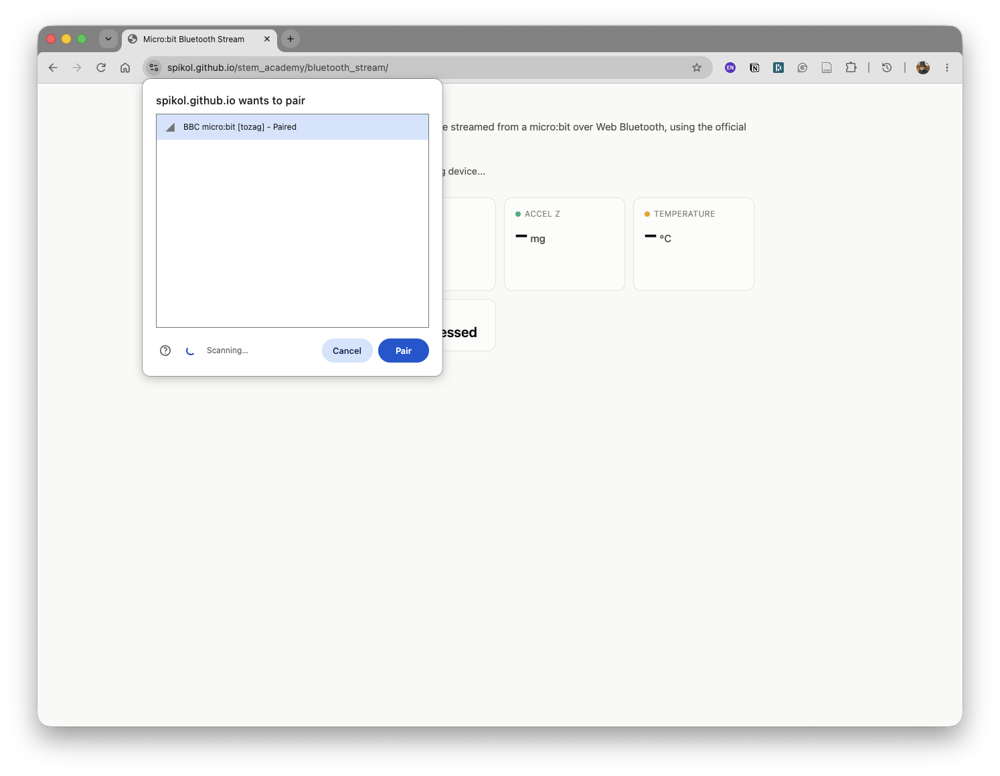
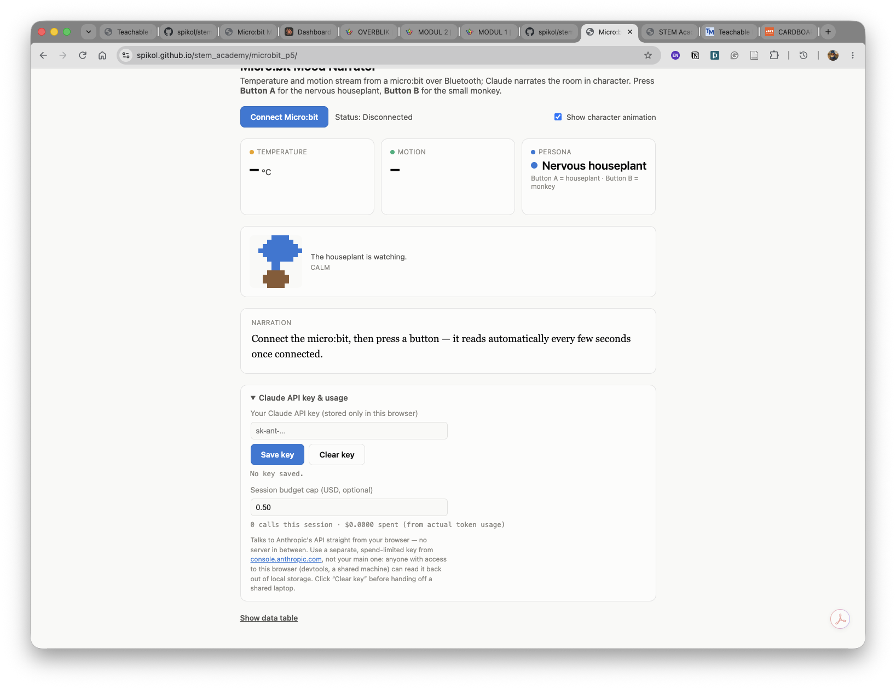

<!-- _class: lead -->


# Micro:bit &rarr; Teachable Machine
# Micro:bit &rarr; LLM Claude


### Workshop

---

## Inpspired from Carboard Robots
- By LOFI Robots - Maciej Wojnicki
- Polish Educator and Fab Lab Pioneer
- https://cardboard.lofirobot.com/

---
## LoFi Robotics Instructions

- https://cardboard.lofirobot.com/teachable-microbit-app-info/

---
## Setup Micro:Bit 1

To make the board discoverable over bluetooth you have to properly set PROJECT SETTINGS in MakeCode (individual for each project!)

1. go to (GEAR ICON) -> PROJECT SETTINGS
2. Set project settings sliders to NO PAIRING
3. Next click EDIT SETTINGS AS TEXT
4. scroll down to section about BLUETOOTH and add this line: “pairing_mode”: 0,

---


---


---
## Setup Micro:Bit 2

```
"config": {
            "microbit-dal": {
                "bluetooth": {
                    "open": 1,
                    "pairing_mode": 0,
                    "whitelist": 0,
                    "security_level": null
                }
            }
        }
```
---
## VERY Important Notes!

- In Teachable Machine model use class names without spaces. If you need multi-word class names, join them with underscores, like this: `this_class_name`

- Teachable Micro:Bit App gets cached in browser memory and to prevent it open the app in new incognito window.

---
## Saving models links
You can pass it as a page address parameter, for example:

- Link to TM model: https://teachablemachine.withgoogle.com/models/Jgyr546VH/
- Take the last part `Jgyr546VH` and add it to the microbit app address like that:
  https://cardboard.lofirobot.com/teachable-microbit/?model=Jgyr546VH

- This way the model will load automatically after opening the app and you can access the model simply by storing this link.
---


## Teachable Machine

https://teachablemachine.withgoogle.com/train

---


---


---
<!-- _class: top-title -->
# Make Code Blocks


---
<!-- _class: top-title -->
# Lofi APP


---
<!-- _class: top-title -->
# Model Select


---
<!-- _class: top-title -->
# Pairing


---

<!-- _class: top-title -->
# Lofi APP


---
# Play Time<!--fit-->

---
# micro:bit & LLMs<!--fit-->

---
<!-- _class: top-title -->
# micro:bit code



---
<!-- _class: top-title -->
### LLM page https://spikol.github.io/stem_academy/



---
<!-- _class: top-title -->
# LLM page


---
<!-- _class: top-title -->
# How It Works

<div style="display:flex; justify-content:center; margin-top:30px;">
<svg width="960" height="293" viewBox="0 0 720 220" xmlns="http://www.w3.org/2000/svg" font-family="system-ui, sans-serif">
  <defs>
    <marker id="arrow" viewBox="0 0 10 10" refX="9" refY="5" markerWidth="7" markerHeight="7" orient="auto-start-reverse">
      <path d="M0,0 L10,5 L0,10 z" fill="#333"/>
    </marker>
  </defs>

  <rect x="10" y="75" width="170" height="70" rx="10" fill="#fff" stroke="#333" stroke-width="2"/>
  <text x="95" y="117" text-anchor="middle" font-size="18" fill="#111">micro:bit</text>

  <rect x="275" y="75" width="170" height="70" rx="10" fill="#fff" stroke="#333" stroke-width="2"/>
  <text x="360" y="117" text-anchor="middle" font-size="18" fill="#111">Website</text>

  <rect x="540" y="75" width="170" height="70" rx="10" fill="#fff" stroke="#333" stroke-width="2"/>
  <text x="625" y="110" text-anchor="middle" font-size="18" fill="#111">Claude</text>
  <text x="625" y="130" text-anchor="middle" font-size="18" fill="#111">API</text>

  <line x1="180" y1="95" x2="273" y2="95" stroke="#333" stroke-width="2" marker-end="url(#arrow)"/>
  <text x="226" y="80" text-anchor="middle" font-size="12" fill="#555">sensor data</text>
  <text x="226" y="65" text-anchor="middle" font-size="11" fill="#777">USB or Bluetooth</text>

  <line x1="445" y1="95" x2="538" y2="95" stroke="#333" stroke-width="2" marker-end="url(#arrow)"/>
  <text x="491" y="80" text-anchor="middle" font-size="12" fill="#555">prompt</text>
  <text x="491" y="65" text-anchor="middle" font-size="11" fill="#777">HTTPS</text>

  <line x1="538" y1="130" x2="447" y2="130" stroke="#333" stroke-width="2" marker-end="url(#arrow)"/>
  <text x="491" y="150" text-anchor="middle" font-size="12" fill="#555">response</text>

  <line x1="273" y1="130" x2="182" y2="130" stroke="#333" stroke-width="2" marker-end="url(#arrow)"/>
  <text x="226" y="150" text-anchor="middle" font-size="11" fill="#555">shown on screen /</text>
  <text x="226" y="165" text-anchor="middle" font-size="11" fill="#555">sent back to board</text>
</svg>
</div>

---
<!-- _class: top-title -->
# API Key - See PADLET

