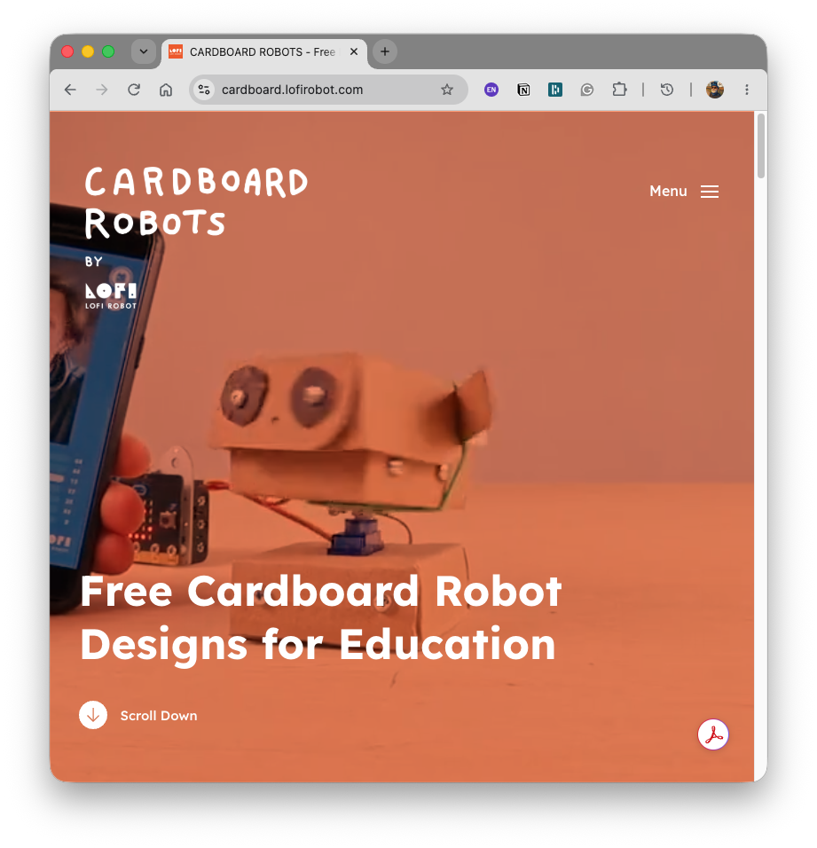
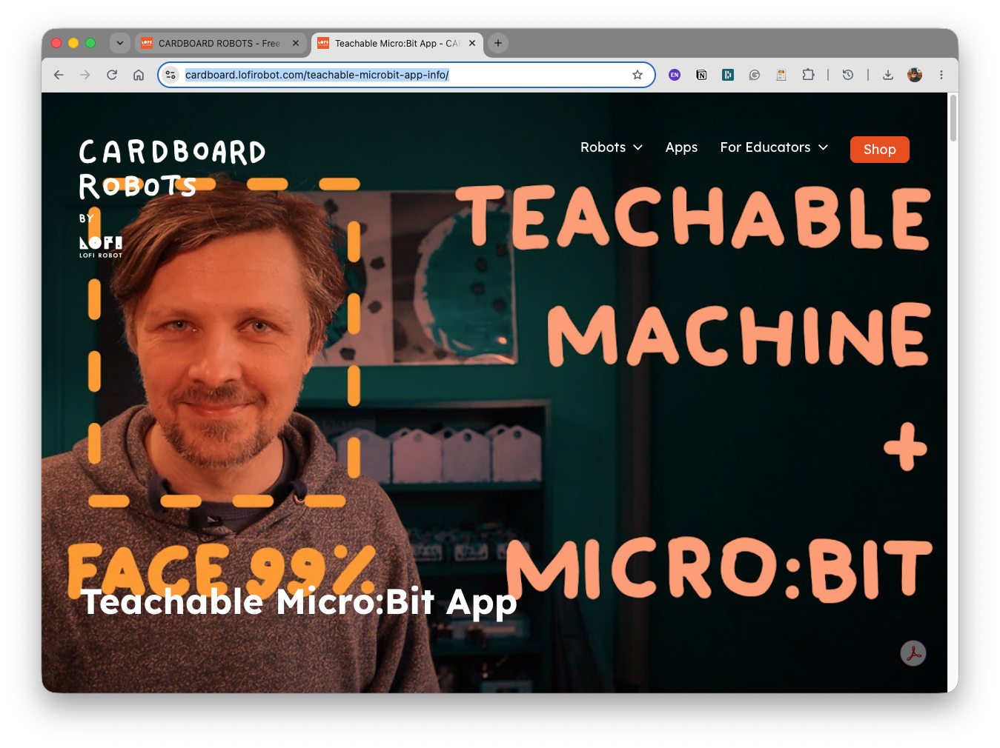
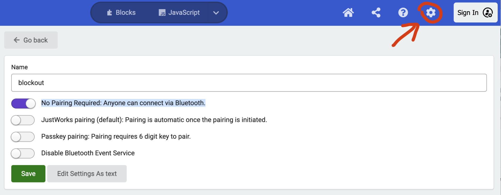
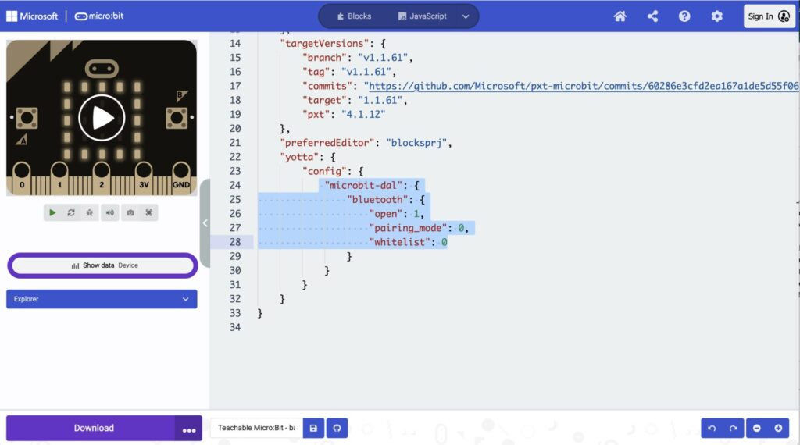
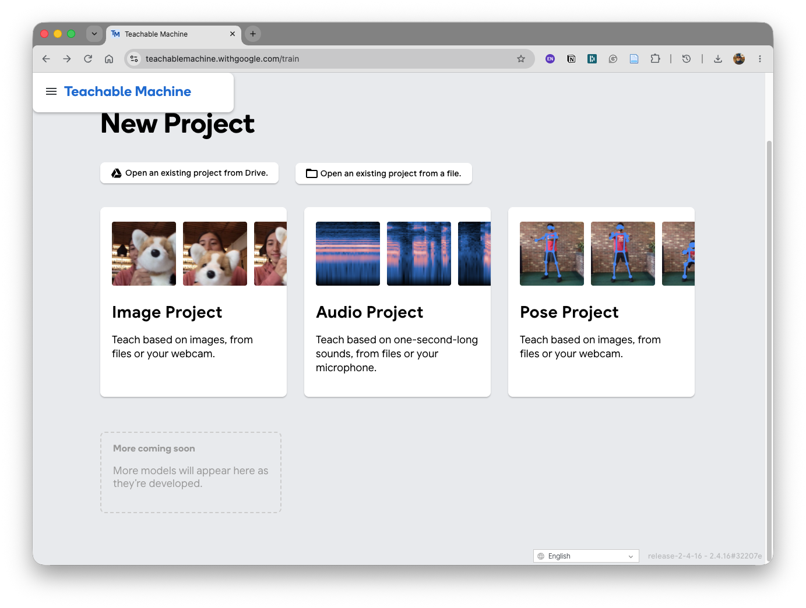
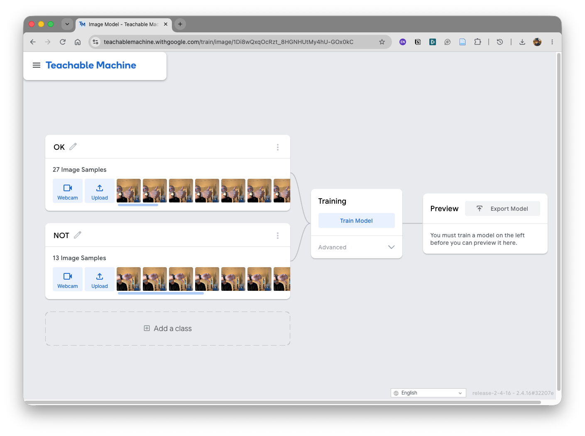
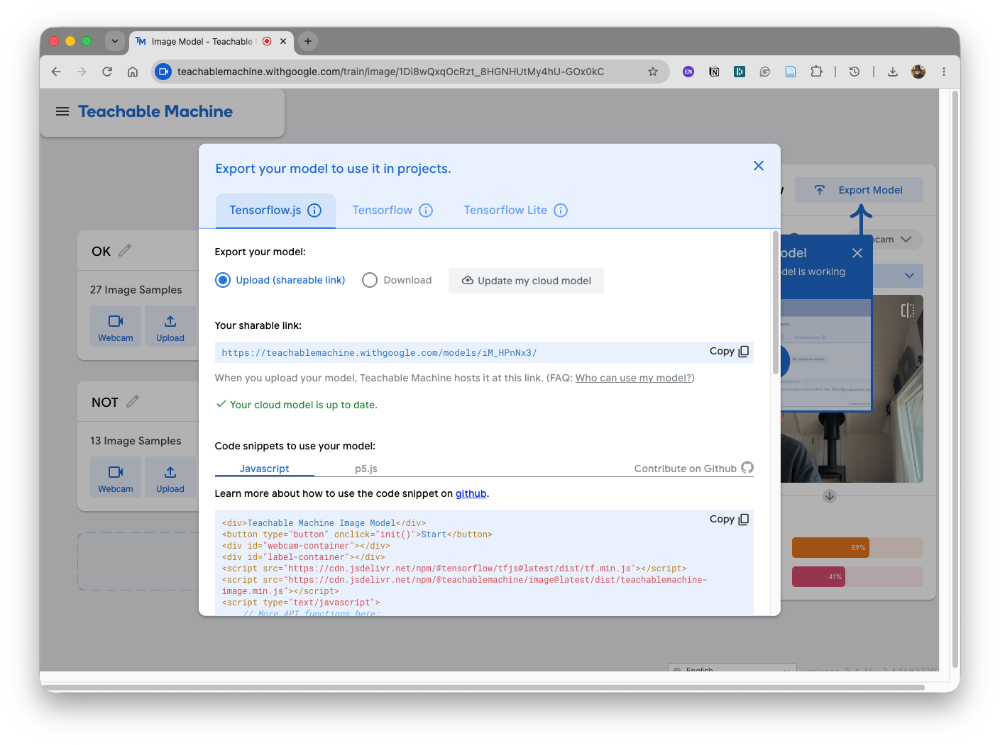
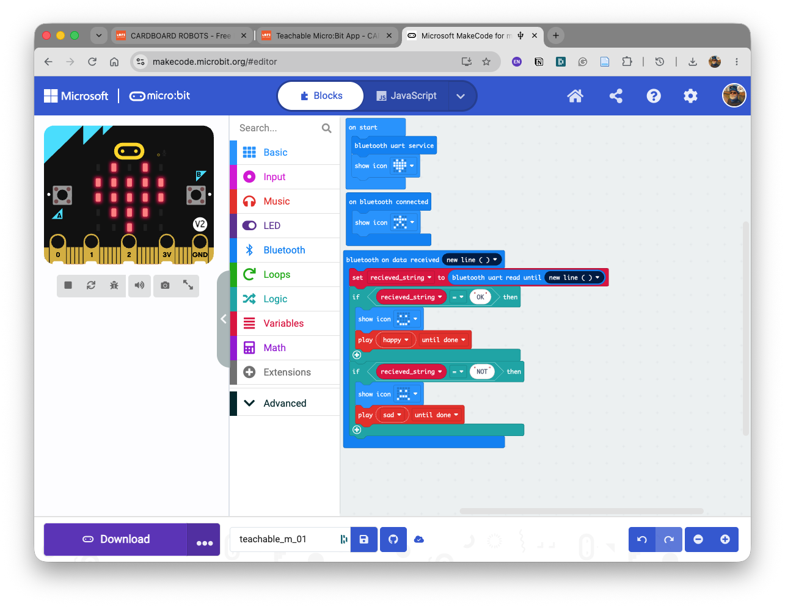
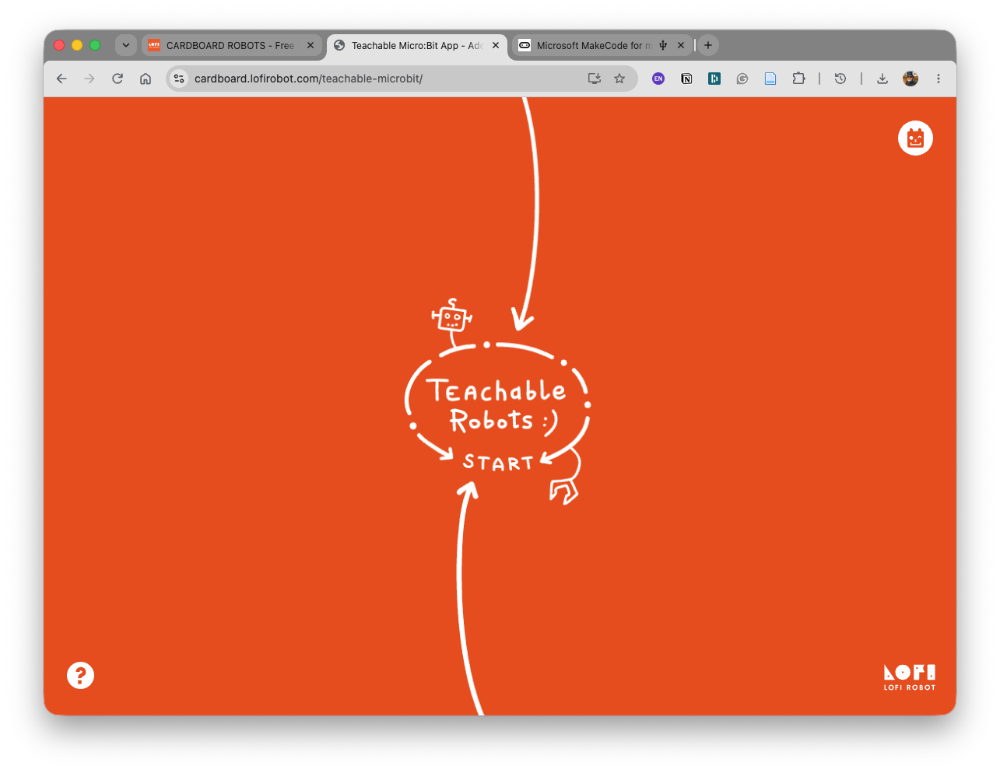
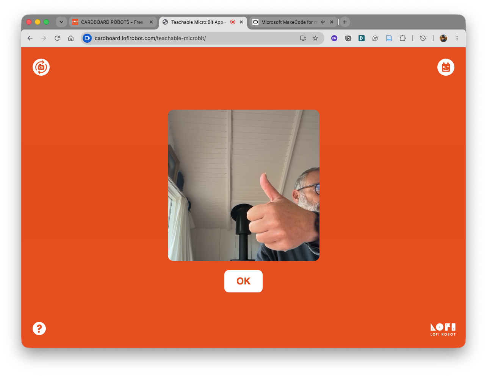

<!-- _class: lead -->


# Micro:bit &rarr; Teachable Machine
# Micro:bit &rarr; LLM Claude


### Workshop

---

## Inpspired from Carboard Robots
- By LOFI Robots - Maciej Wojnicki
- Polish Educator and Fab Lab Pioneer
- https://cardboard.lofirobot.com/

---
## LoFi Robotics Instructions

- https://cardboard.lofirobot.com/teachable-microbit-app-info/

---
## Setup Micro:Bit 1

To make the board discoverable over bluetooth you have to properly set PROJECT SETTINGS in MakeCode (individual for each project!)

1. go to (GEAR ICON) -> PROJECT SETTINGS
2. Set project settings sliders to NO PAIRING
3. Next click EDIT SETTINGS AS TEXT
4. scroll down to section about BLUETOOTH and add this line: “pairing_mode”: 0,

---


---


---
## Setup Micro:Bit 2

```
"config": {
            "microbit-dal": {
                "bluetooth": {
                    "open": 1,
                    "pairing_mode": 0,
                    "whitelist": 0,
                    "security_level": null
                }
            }
        }
```
---
## VERY Important Notes!

- In Teachable Machine model use class names without spaces. If you need multi-word class names, join them with underscores, like this: `this_class_name`

- Teachable Micro:Bit App gets cached in browser memory and to prevent it open the app in new incognito window.

---
## Saving models links
You can pass it as a page address parameter, for example:

- Link to TM model: https://teachablemachine.withgoogle.com/models/Jgyr546VH/
- Take the last part `Jgyr546VH` and add it to the microbit app address like that:
  https://cardboard.lofirobot.com/teachable-microbit/?model=Jgyr546VH

- This way the model will load automatically after opening the app and you can access the model simply by storing this link.
---


## Teachable Machine

https://teachablemachine.withgoogle.com/train

---



---


---
<!-- _class: top-title -->
# Make Code Blocks



---
<!-- _class: top-title -->
# Lofi APP


---
<!-- _class: top-title -->
# Lofi APP
